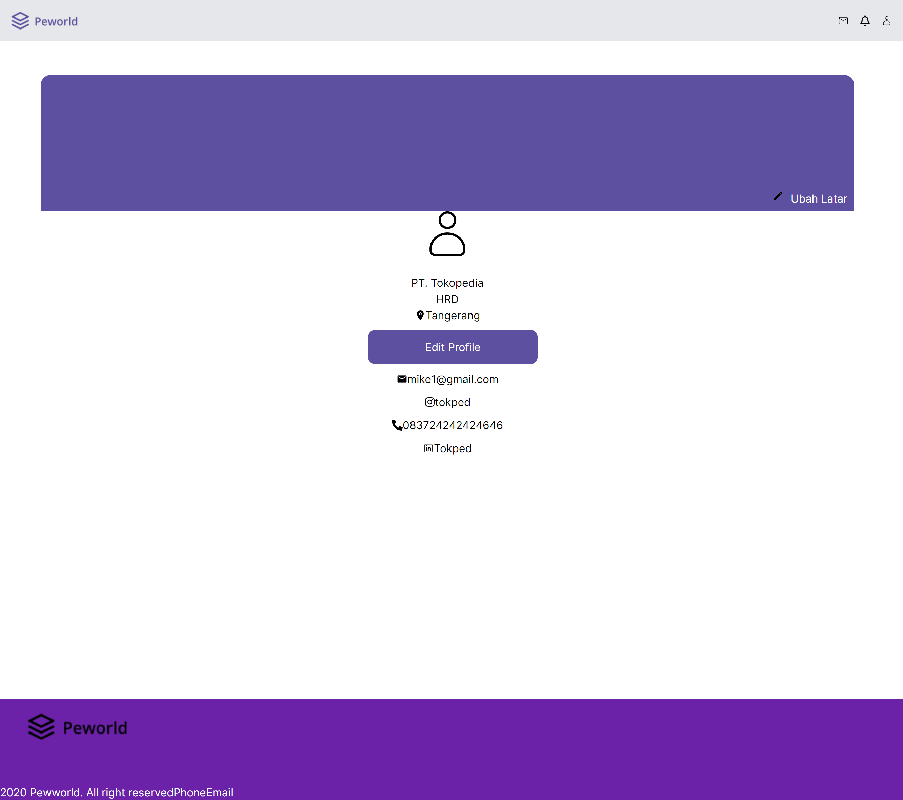

<h1>Peworld</h1>

## About The Project

This website was created for users who want to find workers and also users who want to work.
Features in this Websites Users can upload their work experience and portfolio, and users can also search for 
workers who suit their needs.

## Built With

These are the libraries and services used to build this Front End and Back End Peworld

<ul>
  <li>
   <a href="https://nextjs.org/">Next.js</a>
  </li>
   <li>
   <a href="https://www.prisma.io/">Prisma</a>
  </li>
     <li>
   <a href="https://react.de">React.js</a>
  </li>
    <li>
   <a href="https://tailwindui.com/">Tailwind</a>
  </li>
    <li>
And Other
  </li>
</ul>

## Installation

1. Clone this repository

<pre>git clone https://github.com/abdulnaim6/Fe_peworld</pre>

2. Change directory to Fe_peworld

<pre>cd Hire-job</pre>

3. Install all of the required modules

<pre>npm install / npm i</pre>

4. Run this command to run the server

<pre>npm run dev</pre>

## Screenshot

  

    Register Pekerja
  

  

    Register perekrut
  

  

    Login
  

  

    Landing Page
  

  

    Home
  

  

    Profile Pekerja
  

  

    Edit Profile Pekerja
  

  

    Hire
  

  

    Profile Company
  

  

    Edit Profile Company
  

## Contributing

These contributions are what make the open source community such a great place to learn, and create. Any contribution you make is greatly appreciated.

<ol>
  <li>Fork the Project</li>
  <li>Create your Feature Branch </li>
  <li>Commit your Changes </li>
  <li>Push to the Branch </li>
  <li>Open to pull request</li>
</ol>

## Related Project

⚡[Backend Blanja](https://github.com/abdulnaim6/fwm17-be-peword)⚡

⚡[Frontend Blanja](https://github.com/abdulnaim6/Fe_peworld)⚡

⚡[Demo Peworld]( https://fe-peworld-three.vercel.app/)⚡
